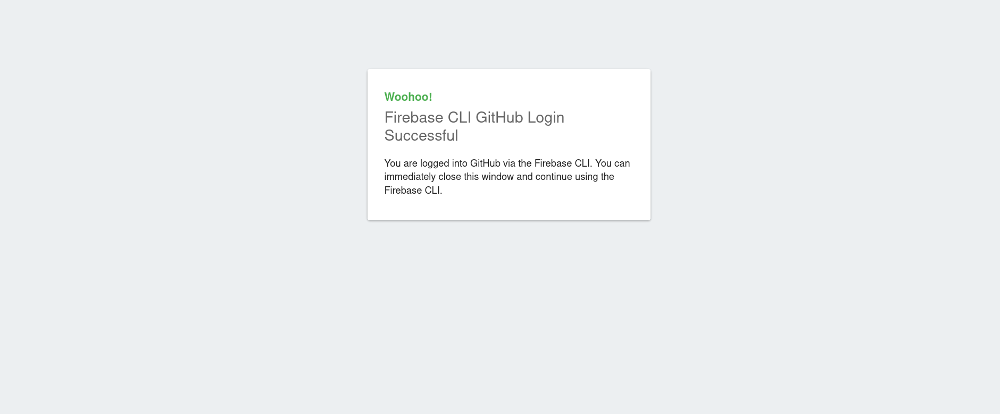

# A First dive into Firebase serverless

A Dive into Firebase serverless offer by epidodes, made out of an excellent video series posted by ["The Net Ninja"](https://www.youtube.com/watch?v=29BNaJiqWB4&list=PL4cUxeGkcC9i_aLkr62adUTJi53y7OjOf&index=2)
* release `0.0.0` = episode 1 https://www.youtube.com/watch?v=29BNaJiqWB4&list=PL4cUxeGkcC9i_aLkr62adUTJi53y7OjOf&index=2
* release `0.0.1` = episode 2 https://www.youtube.com/watch?v=Vik66tAVOBg&list=PL4cUxeGkcC9i_aLkr62adUTJi53y7OjOf&index=3
* release `0.0.2` = episode 3 https://www.youtube.com/watch?v=Vik66tAVOBg&list=PL4cUxeGkcC9i_aLkr62adUTJi53y7OjOf&index=4


## Epidode 1 : spining up a new static website project with firebase serverless capabilities

### How to run the Episode 1's firebase app

* description :
  * we want to generate a full firebase project, for a static website, that will use serverless backend for making various services available to the website visitor.
  * we want a Database
  * we want firebase authentication
  * we want hosting to deploy our static website
  * we want at the end of the Episode 1, our website deployed.
  * we want a basic HTML/css template for the friebase static website

* environment :

```bash
$ firebase --version
10.1.2
$ node -v
v16.13.0
$ npm --version
8.2.0
$ lsb_release -a
No LSB modules are available.
Distributor ID:	Debian
Description:	Debian GNU/Linux 9.12 (stretch)
Release:	9.12
Codename:	stretch
$ bash --version
GNU bash, version 4.4.12(1)-release (x86_64-pc-linux-gnu)
Copyright (C) 2016 Free Software Foundation, Inc.
License GPLv3+: GNU GPL version 3 or later <http://gnu.org/licenses/gpl.html>

This is free software; you are free to change and redistribute it.
There is NO WARRANTY, to the extent permitted by law.

```

And here is how to :

* run the Episode 1's firebase app :

```bash
export FIREBASE_CLI_DESIRED_VERSION="10.1.2"
npm remove -g firebase-tools && npm install -g firebase-tools@${FIREBASE_CLI_DESIRED_VERSION}

export DESIRED_VERSION="0.0.0"
export WORK_DIR="$(pwd)/firebase-firstdive"
git clone git@github.com:pokus-io/pokus-firebase-firstdive.git ${WORK_DIR}
cd ${WORK_DIR}
git checkout ${DESIRED_VERSION}
npm i
firebase serve
```

### How to compile the sererless functions the Episode 1's firebase app

* compile the sererless functions of the firebase app :

```bash
export FIREBASE_CLI_DESIRED_VERSION="10.1.2"
npm remove -g firebase-tools && npm install -g firebase-tools@${FIREBASE_CLI_DESIRED_VERSION}

export DESIRED_VERSION="0.0.0"
export WORK_DIR="$(pwd)/firebase-firstdive"
git clone git@github.com:pokus-io/pokus-firebase-firstdive.git ${WORK_DIR}
cd ${WORK_DIR}
git checkout ${DESIRED_VERSION}
npm i

cd functions/
npm run build
```


### How to deploy the Episode 1's firebase app

>
> First, you have to know that deploying to `Firebase hosting` **is not free**, so **you will have** to upgrade your account **to the "pay as you go" Google Firebase plan**.
>
> That was a problem to me :
> * I wanted to depoy to a free hsoting solution
> * that's why i will try in Episode 2, to change the depoyement autpation assets, so that deployment goes to :
>   * `${pokus-firebase-webapp}.surge.sh`
>   * `${pokus-firebase-webapp}.dokku.io`
>   * `${pokus-firebase-webapp}.back4app.io`
> ... see that in Epidode 2

* deploy the firebase app like this :

```bash
# what i love about that command : it runs ESLint on TypeScript
firebase deploy
```

For this command to succeed, you will need to upgrade yor Google account, for the Google Firebase "pay-as-you-go" plan, otherwise you will get the following error on the std err of the `Firebase CLI` :

```bash
Error: Your project pokus-firebase-firstdive must be on the Blaze (pay-as-you-go) plan to complete this command. Required API cloudbuild.googleapis.com can't be enabled until the upgrade is complete. To upgrade, visit the following URL:

https://console.firebase.google.com/project/pokus-firebase-firstdive/usage/details
```

Read also about that error in [Episode 2's Wishlist](#episode-2s-wishlist)

### Episode 2's Wishlist

* we want a basic HTML/css template for the friebase static website :
  * [ ] based on material design for the web : https://material.io/develop/web
  * with a ui which looks like app.circleci.com :
    * [ ] first Firebase OAuth2 login (later add Github OAuth2 as well)
    * when logged in with Github, you end up opening a new page wiht a dashboard, where you can :
      * [ ] create new trends to upvote for
      * [ ] create new voting sessions
      * [ ] upvote a given trend by clicing the upvote buttons (all results in Firebase database)
* [ ] change deployment target options, and add related automation asets, using cirlce ci along Github actiosn generated by firebase cli :
>
> First, you have to know that deploying to `Firebase hosting` **is not free**, so **you will have** to upgrade your account **to the "pay as you go" Google Firebase plan**.
>
> That was a problem to me :
> * I wanted to depoy to a free hsoting solution
> * that's why i will try in Episode 2, to change the depoyement autpation assets, so that deployment goes to :
>   * `${pokus-firebase-webapp}.surge.sh`
>   * `${pokus-firebase-webapp}.dokku.io`
>   * `${pokus-firebase-webapp}.back4app.io`
> ... see that in Epidode 2

* Indeed, for the firebase deploy command, i get :

```bash
$ firebase deploy

=== Deploying to 'pokus-firebase-firstdive'...

i  deploying firestore, functions, hosting
Running command: npm --prefix "$RESOURCE_DIR" run lint

> lint
> eslint --ext .js,.ts .


/home/jibl/pokus/firebase-firstdive/functions/src/index.ts
  11:1  error  Expected indentation of 2 spaces but found 1  indent
  12:1  error  Expected indentation of 2 spaces but found 1  indent

✖ 2 problems (2 errors, 0 warnings)
  2 errors and 0 warnings potentially fixable with the `--fix` option.


Error: functions predeploy error: Command terminated with non-zero exit code1
jibl@poste-devops-jbl-16gbram:~/pokus/firebase-firstdive$ firebase deploy

=== Deploying to 'pokus-firebase-firstdive'...

i  deploying firestore, functions, hosting
Running command: npm --prefix "$RESOURCE_DIR" run lint

> lint
> eslint --ext .js,.ts .

Running command: npm --prefix "$RESOURCE_DIR" run build

> build
> tsc

✔  functions: Finished running predeploy script.
i  firestore: reading indexes from firestore.indexes.json...
i  cloud.firestore: checking firestore.rules for compilation errors...
✔  cloud.firestore: rules file firestore.rules compiled successfully
i  functions: ensuring required API cloudfunctions.googleapis.com is enabled...
i  functions: ensuring required API cloudbuild.googleapis.com is enabled...
i  functions: ensuring required API artifactregistry.googleapis.com is enabled...
✔  functions: required API cloudfunctions.googleapis.com is enabled
⚠  functions: missing required API artifactregistry.googleapis.com. Enabling now...
⚠  functions: missing required API cloudbuild.googleapis.com. Enabling now...

Error: Your project pokus-firebase-firstdive must be on the Blaze (pay-as-you-go) plan to complete this command. Required API cloudbuild.googleapis.com can't be enabled until the upgrade is complete. To upgrade, visit the following URL:

https://console.firebase.google.com/project/pokus-firebase-firstdive/usage/details

Having trouble? Try firebase [command] --help

```

* bring up one more fancy UI features : a beautiful carousel...?


### Episode 1's Timelapse

* execute :

```bash
export WORK_DIR="$(pwd)/firebase-firstdive"
mkdir -p ${WORK_DIR}
cd ${WORK_DIR}
git init
mkdir -p documentation/images/
touch documentation/images/README.md

git add -A && git commit -m "init src"

# firebase login will be intractive, opening
# your browser to authentiate your just like for gmail
firebase login
```

* When Firebase login is successful you'll end up in this web page :


* and you will get back to sheel terminal to see :

```bash
$ firebase login
i  Firebase optionally collects CLI usage and error reporting information to help improve our products. Data is collected in accordance with Google's privacy policy (https://policies.google.com/privacy) and is not used to identify you.

? Allow Firebase to collect CLI usage and error reporting information? No

Visit this URL on this device to log in:
https://accounts.google.com/o/oauth2/auth?client_id=<your google fclient id here>.apps.googleusercontent.com&scope=email%20openid%20https%3A%2F%2Fwww.googleapis.com%2Fauth%2Fcloudplatformprojects.readonly%20https%3A%2F%2Fwww.googleapis.com%2Fauth%2Ffirebase%20https%3A%2F%2Fwww.googleapis.com%2Fauth%2Fcloud-platform&response_type=code&state=8369960&redirect_uri=http%3A%2F%2Flocalhost%3A9005

Waiting for authentication...

✔  Success! Logged in as jean.baptiste.lasselle@gmail.com

```

* we need to generate the projet, and before using the firebase cli command to do that :
  * We need to create one app named `pokus-firebase-firstdive` in the Google Firebase dashboard at https://firebase.google.com
  * we will jave to choose options for the following firebase services :
    * database :
      * 2 options, either a `Firestore` DB, or a `Realtime` Db, we will choose a `Firestore` DB, just liek our frined `@The Net Ninja`.
      * We need to create the Firestore Database, for the `pokus-firebase-firstdive` app, in the Google Firebase dashboard at https://firebase.google.com
    * hosting
    * Firebase Functions (that we will use to deploy Lambdas an use thsoe lambadas. Google Firebase Auth is a lambda)
    * but not google anaytics

To go to firebase dashboard :
* go to https://firebase.google.com/, and click on top right corner button `Go to console` :


* then click on the `Create New Project` button :


* Then we create create database, hosting, and serverless functions in the Firebase Dashboard :


* details for creating th database :

> * `STEP1` click on create firestore database button :

> * `STEP2` choose production or test mode:

> * `STEP3` choose region, i chose europe because I am in France:


* then execute this to generate the project :

```bash
firebase init

# #  #  #  #  #  #  #  #  #  #  #  #  #  #  #  #  #  #  #  #  #  #  #  #  #  #  #  #  #  #  #
# #  #  #  #  #  #  #  #  #  #  #  #  #  #  #  #  #  #  #  #  #  #  #  #  #  #  #  #  #  #  #
#
# $ firebase init --help
# Usage: firebase init [options] [feature]
#
# Interactively configure the current directory as a Firebase project or initialize new features in an already configured Firebase project directory.
#
# This command will create or update 'firebase.json' and '.firebaserc' configuration files in the current directory.
#
# To initialize a specific Firebase feature, run 'firebase init [feature]'. Valid features are:
#
#   - database
#   - emulators
#   - firestore
#   - functions
#   - hosting
#   - hosting:github
#   - remoteconfig
#   - storage
#
# Options:
#   -h, --help  output usage information
#

# #  #  #  #  #  #  #  #  #  #  #  #  #  #  #  #  #  #  #  #  #  #  #  #  #  #  #  #  #  #  #
# #  #  #  #  #  #  #  #  #  #  #  #  #  #  #  #  #  #  #  #  #  #  #  #  #  #  #  #  #  #  #
#
# $ firebase init database --help
# Usage: firebase init [options] [feature]
#
# Interactively configure the current directory as a Firebase project or initialize new features in an already configured Firebase project directory.
#
# This command will create or update 'firebase.json' and '.firebaserc' configuration files in the current directory.
#
# To initialize a specific Firebase feature, run 'firebase init [feature]'. Valid features are:
#
#   - database
#   - emulators
#   - firestore
#   - functions
#   - hosting
#   - hosting:github
#   - remoteconfig
#   - storage
#
# Options:
#   -h, --help  output usage information

```

```bash
$ firebase init

     ######## #### ########  ######## ########     ###     ######  ########
     ##        ##  ##     ## ##       ##     ##  ##   ##  ##       ##
     ######    ##  ########  ######   ########  #########  ######  ######
     ##        ##  ##    ##  ##       ##     ## ##     ##       ## ##
     ##       #### ##     ## ######## ########  ##     ##  ######  ########

You're about to initialize a Firebase project in this directory:

  /home/jibl/pokus/firebase-firstdive

? Which Firebase features do you want to set up for this directory? Press Space
 to select features, then Enter to confirm your choices. (Press <space> to sele
ct, <a> to toggle all, <i> to invert selection, and <enter> to proceed)
 ◯ Remote Config: Configure a template file for Remote Config
 ◯ Realtime Database: Configure a security rules file for Realtime Database and
 (optionally) provision default instance
❯◉ Firestore: Configure security rules and indexes files for Firestore
 ◉ Functions: Configure a Cloud Functions directory and its files
 ◉ Hosting: Configure files for Firebase Hosting and (optionally) set up GitHub
 Action deploys

```

* then in the firebse cli init process we wiil be asked to choose the existing project we created `pokus-firebase-firstdive` :

```bash
$ firebase init

     ######## #### ########  ######## ########     ###     ######  ########
     ##        ##  ##     ## ##       ##     ##  ##   ##  ##       ##
     ######    ##  ########  ######   ########  #########  ######  ######
     ##        ##  ##    ##  ##       ##     ## ##     ##       ## ##
     ##       #### ##     ## ######## ########  ##     ##  ######  ########

You're about to initialize a Firebase project in this directory:

  /home/jibl/pokus/firebase-firstdive

? Which Firebase features do you want to set up for this directory? Press Space
 to select features, then Enter to confirm your choices. Firestore: Configure s
ecurity rules and indexes files for Firestore, Functions: Configure a Cloud Fun
ctions directory and its files, Hosting: Configure files for Firebase Hosting a
nd (optionally) set up GitHub Action deploys

=== Project Setup

First, let's associate this project directory with a Firebase project.
You can create multiple project aliases by running firebase use --add,
but for now we'll just set up a default project.

? Please select an option: Use an existing project
? Select a default Firebase project for this directory: (Use arrow keys)
❯ pokus-firebase-firstdive (pokus-firebase-firstdive)

```

* At some point of the project generation with the firebase CLI, we have a question about whether we want to add github automation to the project, and this spins-up again the browser for Github OAuth2 atuthentication/authorize the OAuth2 App :

```bash
? Set up automatic builds and deploys with GitHub? Yes
```




* Then I get asked for which github repository I want to set up the Firebase GIthub AUtomation for builds and deployements :

```bash
Waiting for authentication...

✔  Success! Logged into GitHub as Jean-Baptiste-Lasselle

? For which GitHub repository would you like to set up a GitHub workflow? (form
at: user/repository)

```
* So I create the repository https://github.com/pokus-io/pokus-firebase-firstdive ,a nd I gave its name to firebase cli :

```bash

Waiting for authentication...

✔  Success! Logged into GitHub as Jean-Baptiste-Lasselle

? For which GitHub repository would you like to set up a GitHub workflow? (form
at: user/repository) pokus-io/pokus-firebase-firstdive

```
* And I complete the last steps of firebase project initialization, and end up with this full std out of the firbase CLI (giving all details about my configuration choices) :

```bash
$ firebase init

     ######## #### ########  ######## ########     ###     ######  ########
     ##        ##  ##     ## ##       ##     ##  ##   ##  ##       ##
     ######    ##  ########  ######   ########  #########  ######  ######
     ##        ##  ##    ##  ##       ##     ## ##     ##       ## ##
     ##       #### ##     ## ######## ########  ##     ##  ######  ########

You're about to initialize a Firebase project in this directory:

  /home/jibl/pokus/firebase-firstdive

? Which Firebase features do you want to set up for this directory? Press Space
 to select features, then Enter to confirm your choices. Firestore: Configure s
ecurity rules and indexes files for Firestore, Functions: Configure a Cloud Fun
ctions directory and its files, Hosting: Configure files for Firebase Hosting a
nd (optionally) set up GitHub Action deploys

=== Project Setup

First, let's associate this project directory with a Firebase project.
You can create multiple project aliases by running firebase use --add,
but for now we'll just set up a default project.

? Please select an option: Use an existing project
? Select a default Firebase project for this directory: pokus-firebase-firstdiv
e (pokus-firebase-firstdive)
i  Using project pokus-firebase-firstdive (pokus-firebase-firstdive)

=== Firestore Setup

Firestore Security Rules allow you to define how and when to allow
requests. You can keep these rules in your project directory
and publish them with firebase deploy.

? What file should be used for Firestore Rules? firestore.rules

Firestore indexes allow you to perform complex queries while
maintaining performance that scales with the size of the result
set. You can keep index definitions in your project directory
and publish them with firebase deploy.

? What file should be used for Firestore indexes? firestore.indexes.json

=== Functions Setup

A functions directory will be created in your project with sample code
pre-configured. Functions can be deployed with firebase deploy.

? What language would you like to use to write Cloud Functions? TypeScript
? Do you want to use ESLint to catch probable bugs and enforce style? Yes
✔  Wrote functions/package.json
✔  Wrote functions/.eslintrc.js
✔  Wrote functions/tsconfig.json
✔  Wrote functions/tsconfig.dev.json
✔  Wrote functions/src/index.ts
✔  Wrote functions/.gitignore
? Do you want to install dependencies with npm now? Yes

added 394 packages, and audited 395 packages in 56s

63 packages are looking for funding
  run `npm fund` for details

4 low severity vulnerabilities

To address all issues possible (including breaking changes), run:
  npm audit fix --force

Some issues need review, and may require choosing
a different dependency.

Run `npm audit` for details.

=== Hosting Setup

Your public directory is the folder (relative to your project directory) that
will contain Hosting assets to be uploaded with firebase deploy. If you
have a build process for your assets, use your build's output directory.

? What do you want to use as your public directory? public
? Configure as a single-page app (rewrite all urls to /index.html)? No
? Set up automatic builds and deploys with GitHub? Yes
✔  Wrote public/404.html
✔  Wrote public/index.html

i  Detected a .git folder at /home/jibl/pokus/firebase-firstdive
i  Authorizing with GitHub to upload your service account to a GitHub repository's secrets store.

Visit this URL on this device to log in:
https://github.com/login/oauth/authorize?client_id=<my google client id>&state=425316676&redirect_uri=http%3A%2F%2Flocalhost%3A9005&scope=read%3Auser%20repo%20public_repo

Waiting for authentication...

✔  Success! Logged into GitHub as Jean-Baptiste-Lasselle

? For which GitHub repository would you like to set up a GitHub workflow? (form
at: user/repository) pokus-io/pokus-firebase-firstdive

✔  Created service account github-action-450362581 with Firebase Hosting admin permissions.
✔  Uploaded service account JSON to GitHub as secret FIREBASE_SERVICE_ACCOUNT_POKUS_FIREBASE_FIRSTDIVE.
i  You can manage your secrets at https://github.com/pokus-io/pokus-firebase-firstdive/settings/secrets.

? Set up the workflow to run a build script before every deploy? Yes
? What script should be run before every deploy? npm ci && npm run build

✔  Created workflow file /home/jibl/pokus/firebase-firstdive/.github/workflows/firebase-hosting-pull-request.yml
? Set up automatic deployment to your site's live channel when a PR is merged?
Yes
? What is the name of the GitHub branch associated with your site's live channe
l? master

✔  Created workflow file /home/jibl/pokus/firebase-firstdive/.github/workflows/firebase-hosting-merge.yml

i  Action required: Visit this URL to revoke authorization for the Firebase CLI GitHub OAuth App:
https://github.com/settings/connections/applications/89cf50f02ac6aaed3484
i  Action required: Push any new workflow file(s) to your repo

i  Writing configuration info to firebase.json...
i  Writing project information to .firebaserc...
i  Writing gitignore file to .gitignore...

✔  Firebase initialization complete!

```

Finally we need, in the friebase.google.com daashboard Web UI, to register a new web application for our project :
* this will consist of actually registerign the web app, for firebase authorization (and cross origin cofniurations) for the web app we are developing, when it will be deployed
* this will also help us configure a new hostng environment
* and it will finally give us source code to copy paste in our `intdex.html` : with that, we will be ready to run our new web app locally with the`firebase serve` command

The steps to regiter the web ap :

* `step 0` go to the "Overview" ("Vue d'ensemble") of your firebase project (for me named `pokus-firebase-firsdive`), and click the Web application option button (other button are for IOS / Android mobile apps options) :

* `step 1`  :

* `step 2` copy paste the source code to add on bottom of the `<body>` HTML tag :


* `step 3` run  :
```bash
cd functions/
# -------
# we need this content in the [functions/src/index.ts] to
# avoid [npm run build] copilation errors, due to unused
# delared typescript import
#
cat <<EOF> ./src/index.ts
import * as functions from "firebase-functions";

// // Start writing Firebase Functions
// // https://firebase.google.com/docs/functions/typescript
//
// export const helloWorld = functions.https.onRequest((request, response) => {
//   functions.logger.info("Hello logs!", {structuredData: true});
//   response.send("Hello from Firebase!");
// });
export const helloWorld = functions.https.onRequest((request, response) => {
  functions.logger.info("Hello Pokus logs!", {structuredData: true});
  response.send("Hello from Pokus Serverless on Firebase!");
});
EOF

npm run build

firebase serve

```
* and go to http://localhost:5000/ , wouaou, you are a Firebase Hero now and should see :


* I want to duely note, that I can find docuementation about the hosting options :
  * at https://firebase.google.com/docs/hosting/
  * I want a general overwview otf it, to determine important confiurations options, like TLS certificates probably I imagine

Next epidode, we'll add up a few more things to our new firebase webapp
